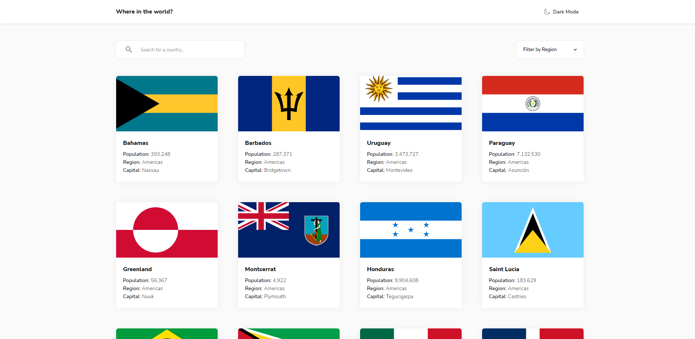

# Frontend Mentor - Easybank landing page challenge hub solution

This is a solution to the [Easybank landing page challenge hub on Frontend Mentor](https://www.frontendmentor.io/challenges/easybank-landing-page-WaUhkoDN). Frontend Mentor challenges help you improve your coding skills by building realistic projects. 
## Table of contents

- [Overview](#overview)
  - [The challenge](#the-challenge)
  - [Screenshot](#screenshot)
  - [Links](#links)
- [My process](#my-process)
  - [Built with](#built-with)
- [Author](#author)

## Overview

### The challenge

Users should be able to:

- View the optimal layout for each of the website's pages depending on their device's screen size
- See hover states for all interactive elements on the page
- View each page and be able to toggle between the tabs to see new information

### Screenshot

### Links

- Solution URL: [GitHub Repo](https://github.com/slenderfigure/-frontend-mentor-challenge-3)
- Live Site URL: [GitHub Pages](https://slenderfigure.github.io/frontend-mentor-challenge-3/)

## My process

### Built with

- Desktop-First Workflow
- Semantic HTML5
- Accessibility in mind
- BEM Methodology
- SCSS
- Flexbox
- CSS Grid
- TypeScript
- JSON
- RxJS
- [Angular](https://angular.io/) - Angular Framework

## Author

- Frontend Mentor - [@slenderfigure](https://www.frontendmentor.io/profile/slenderfigure)
- LinkedIn - [Adison Peña](https://www.linkedin.com/in/adison-pe%C3%B1a-945b36218/)